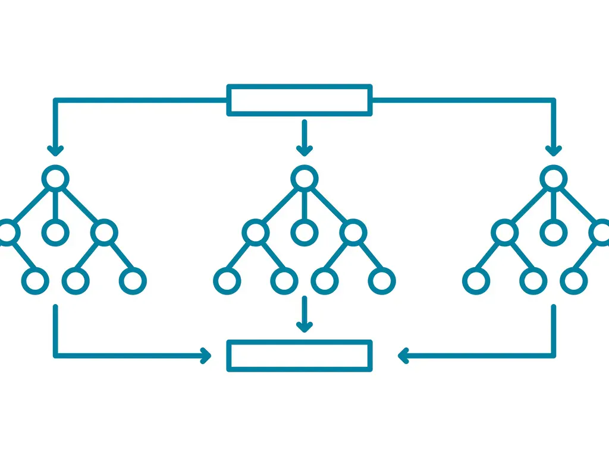

# Applications of Data-Mining-and-Machine-Learning

  

## Overview

This project is part of the course "Applications of Data Mining and Machine Learning" offered by the Artificial Intelligence and Machine Learning Lab at TU Darmstadt. The repository includes applications of scikit-learn models as well as implementations of machine learning algorithms from scratch.

## Task 1:

- Classification and regression with self defined boundary, accuracy and error
  
## Task 2: 

- Cross validation with self defined split
- K-nearest neighbour on iris dataset with different k and parameter study
- Polynomial regression

## Task 3:

- PR curve, ROC curve, confusion matrix with Random Forrest Classifier
- Evaluation of different metrics

## Task 4:

- Classification and regression with decision trees
  
## Task 5: 

- Classification of Random Forrest vs. Decision Trees with different number of depths, features and estimators (Hyperparameter study)
  
## Task 6:

- Adaboost classification with decision boundaries
- Gradient Boosting regression with regularization, different metrics, learning rates: a performance comparison
  
## Task 8:

- SVM classification: linear, polynomial, RBF Kernel and different regularization
- SVM label classification parameter optimization with grid search
- K-Means clustering
  
## Task 10

- Principal Component Analysis for dimensional reduction, variance explaination, data compression, 
